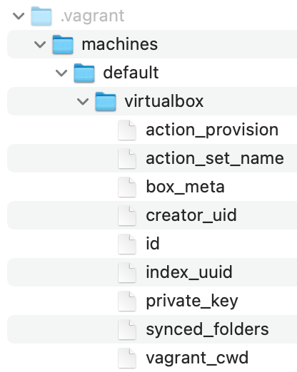

# Übung 3

**Vorbereitung:**

Homebrew ist eine freie und quelloffene Paketverwaltung, welche die Installation von Software auf den Betriebssystemen Linux und macOS vereinfacht. Für diese und die folgenden Übungen kann es hilfreich sein, Homebrew vorab zu installieren: [Homebrew](https://brew.sh/) 

Auch dieses Repository können Sie wieder über git klonen.

**Aufgabe 1 - Provisionierung einer Virtuellen Maschine und eines Webservers mit Vagrant**

Anmerkung: Für diese Aufgabe benötigen wir VirtualBox. Leider funktioniert VirtualBox nicht mit jedem Rechner-Chipsatz zuverlässig. Problematisch sind z. B. MacBooks mit Apple Silicon Chips.

- Installieren Sie [VirtualBox](https://www.virtualbox.org/)
- Installieren Sie [Vagrant](https://developer.hashicorp.com/vagrant/install)
- Legen Sie ein Verzeichnis für diese Aufgabe an

Öffnen Sie ein Terminal und navigieren Sie in das Verzeichnis für diese Aufgabe.  

Prüfen Sie folgendermaßen, ob Vagrant korrekt installiert ist:  

   ```bash
vagrant --version
   ```
Initialisieren Sie ein Vagrantfile mit einem Ubuntu-Image:

   ```bash
vagrant init bento/ubuntu-22.04
   ```
Prüfen Sie, ob ein Vagrantfile angelet wurde und schauen Sie es sich einmal an. Die meisten Zeilen sind momentan noch auskommentiert, aber das ändern wir noch.  

Starten Sie nun eine Vagrant-VM mit

   ```bash
vagrant up
   ```

Prüfen Sie den Status der VM:

   ```bash
vagrant status
   ```

Schauen Sie sich die ssh-Konfiguration der Maschine an:

   ```bash
vagrant ssh-config
   ```

Sie können die VM folgendermaßen über ssh ansteuern:

   ```bash
vagrant ssh
   ```
Anmerkung: Wenn Sie die VM über ssh ansteuern, greift Vagrant auf den privaten Schlüssel zu, der beim Starten der Maschine angelegt wurde. Gehen Sie dazu einmal in das Verzeichnis mit dem Vagrantfile. Lassen Sie sich ggf. auch versteckte Verzeichnise und Dateien anzeigen. Sie sollten dort ein Verzeichnis finden, dass

   ```bash
.vagrant
   ```
heißt, die folgende Verzeichnisstruktur aufweist und den privaten Schlüssel für die Verbindung enthält:



Führen Sie zunächst mal ein Update durch mit:

   ```bash
sudo apt-get update
   ```
Installieren Sie nun einen Apache Webserver auf der VM:

   ```bash
sudo apt-get install apache2 –y
   ```

Starten Sie nun den Webserver mit:

   ```bash
sudo service apache2 start
   ```
Prüfen Sie den Status des Webservers:
   ```bash
sudo service apache2 status
   ```
Öffnen Sie nun ein neues Terminal und navigieren Sie in das Verzeichnis, in dem das Vagrantfile liegt.

Steuern Sie nun die Vagrant-VM per ssh an:

   ```bash
vagrant ssh
   ```
Sie können den Server nun mit cURL aufrufen:

   ```bash
curl localhost
   ```

Was bekommen Sie zurück?  

Ermitteln Sie nun die IP-Adresse der VM mit:

   ```bash
ip route get 1.2.3.4 | awk '{print $7}'

   ```
Sie können nun einmal überprüfen, ob Sie mit cURL den gleichen Output bekommen:

   ```bash
curl [IP-Adresse]
   ```
Probieren Sie einmal die IP-Adresse im Browser aufzurufen:

   ```bash
http://[IP-Adresse]
   ```
Was passiert und warum ist das so?  

Wir fahren den Server und die VM nun zunächst einmal wieder herunter. Hierzu öffnen wir ein neues Terminal, und lassen uns zunächst einmal alle Vagrant-VMs anzeigen mit:

   ```bash
vagrant global-status

   ```
Sie sollten nun ihre Vagrant-VM und ihre zugehörige Prozess-ID sehen. Über folgenden Befehl können sie diese herunterfahren und löschen:

   ```bash
vagrant destroy [Prozess-ID]

   ```
Öffnen Sie das Vagrantfile nun einmal mit einem Code- oder Texteditor. Löschen Sie die Raute # vor folgenden Zeilen (Kommentierung) und speichern Sie die Datei so:

   ```bash
config.vm.network "private_network", ip: "192.168.33.10"

   ```
   ```bash
config.vm.network "public_network"

   ```
   ```bash
config.vm.network "forwarded_port", guest: 80, host: 8080

   ```
Starten Sie die Vagrant-VM nun noch einmal und installieren Sie den Apache Webserver wie in den Schritten oben erklärt.  

Hinweis: Wenn Sie die Vagrant-VM neu starten, werden Sie gefragt, über welche Schnittstelle diese zugänglich sein soll. Hier können Sie z.B. die WLAN-Verbindung auswählen. Rufen Sie nun in ihrem Browser die o.g. IP-Adresse auf:
```bash
http://192.168.33.10
```
Sie sollten nun den Startbildschirm des Apache Webservers sehen.


**Aufgabe 2 - Provisionierung eines Nginx Webservers mit Terraform**

Anmerkung: Obwohl wir uns erst zu einem späteren Zeitpunkt noch genauer mit Container-Technologien befassen werden, können wir für diese Übung der Einfachheit halber schon einmal Docker verwenden.  

- Installieren Sie [Docker Desktop](https://www.docker.com/products/docker-desktop/)

Starten Sie Docker Desktop. Über die Kommandozeile geht das auch folgendermaßen:

   ```bash
open -a Docker
   ```

Anmerkung: Obwohl wir es jetzt noch nicht brauchen, können Sie unter Settings --> Kubernetes schon einmal Kubernetes aktivieren. Setzen Sie einfach den entsprechenden Haken.  

- Installieren Sie [Terraform](https://www.terraform.io/)

Über Homebrew können Sie Terraform folgendermaßen installieren:


